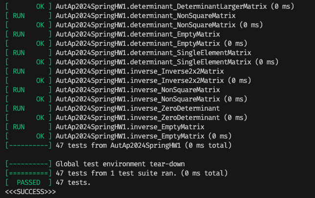

## Env Setup
`2024.07.22-07.25`
- Gtest not found:
https://stackoverflow.com/questions/24295876/cmake-cannot-find-googletest-required-library-in-ubuntu
- Hackmd: https://hackmd.io/@NanaEilish727/aut-hw1

## Build and Run
```shell
// build
rm -rf build
mkdir build
cd build
cmake ..
make
// run
./main
```

## Screenshot
