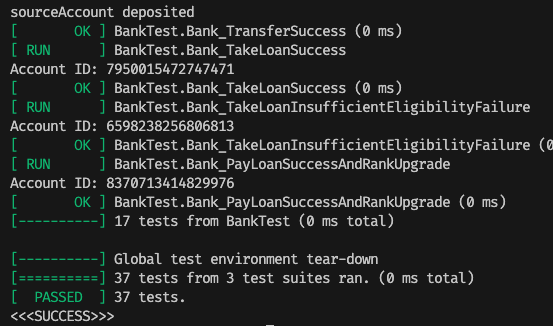

# HW2: Bank System

## Environment
https://medium.com/@jackercleaninglab/dockerfile-%E5%BB%BA%E7%AB%8B%E8%87%AA%E8%A8%82%E6%98%A0%E5%83%8F%E6%AA%94-%E6%9E%B6%E8%B5%B7%E7%B6%B2%E7%AB%99%E5%BF%AB%E9%80%9F%E5%8F%88%E7%B0%A1%E5%96%AE-%E4%B8%80-22b2743f97b9

```shell
# build the image
docker build -t Nana2929/aut-ap-hw2 .
# run the container
docker run -d -p 3000:3000 -v ${PWD}:/usr/src/app Nana2929/aut-ap-hw2
# check container id
docker ps
# enter the container
docker exec -it {id} bash

// inside the container
mkdir build
cd build
cmake ..
make
./main
```

## Questions along the way
### How to validate a const member? [StackOverflow](https://stackoverflow.com/questions/53498536/how-to-validate-the-initialization-of-a-const-member-variable-before-assigning-i)
  - `const` member needs to be initialized in the constructor initializer list
  - What if this `const` member has certain validation rules?
```cpp
    class A {
    public:
        A(int x) : x(x) {
            if (!isValid(x)) {
                throw std::invalid_argument("Invalid x");
            }
        }
        bool isValid(int x) {
            return x > 0;
        }
    private:
        const int x;
    };
```

### Forwar Declaration
- 先告訴編譯器有這樣一個類別存在（宣告），但是這個時候還先不告訴你他的實際內容（定義）；在這個狀況下，這個類別會是「incomplete type」，可以有限度地使用。
- 若你要創造一個名為 B 的類別時，它有個成員為 A 類別的指標，這種情況我們通常會在 `B.h` 的上端寫一句 `#include "A.h"`一切運行如常。但當我們更動了 `A.h` 檔時，
 Compiler 在編譯的時後會重編所有 include `A.h` 的檔案，這當然包括 `Class B`，無謂的重編會浪費時間。
- 此處我們只有宣告 Class A 讓編譯 B 時不發生錯誤，A 類別的實際大小並不知道，
所以我們只能在宣告成員變數為 reference 或 pointer 才可以使用這個技巧，
```cpp
class Bank; // Forward declaration of Bank
class Person; // Forward declaration of Person

// Represents a bank account with owner, bank, balance, status, and credentials
class Account {
...}

```

### Reference and Pointers
```cpp
Person&
std::map<Person*, std::vector<Account*>> customer_2_accounts;
```
- in C++, when you have a reference to an object and you use the address-of operator (&) on that reference, you get a pointer to the object.

## Erase, Remove (if) Idiom
- `std::remove:`
```cpp
template <class ForwardIterator, class T>  ForwardIterator remove (ForwardIterator first, ForwardIterator last, const T& val);
// Transforms the range `[first,last)` into a range with all the elements that compare equal to `val` removed, and returns an iterator to the new end of that range.
```
- `std::remove_if`
```cpp
template <class ForwardIterator, class UnaryPredicate>  ForwardIterator remove_if (ForwardIterator first, ForwardIterator last, UnaryPredicate pred);
// Transforms the range [first,last) into a range with all the elements for which pred returns true removed, and returns an iterator to the new end of that range.
// - 搭配 lambda function 使用 (UnaryPredicate pred)
```
- 搭配 `std::erase` 使用
```cpp
std::vector<int> v = {1, 2, 3, 4, 5, 6, 7, 8, 9, 10};
v.erase(std::remove_if(
    v.begin(), v.end(),
    [](int i) { return i % 2 == 0; }),
    v.end());
// v is now {1, 3, 5, 7, 9}
```
```cpp
Bank::delete_customer(Person& owner){ ...
    this->bank_accounts.erase(std::remove_if(this->bank_accounts.begin(),
        this->bank_accounts.end(),
        [&acc_to_del](Account* acc){
            return acc_to_del.find(acc) != acc_to_del.end();
        }), this->bank_accounts.end());
}
```

