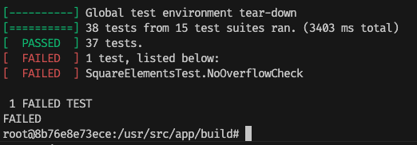

# Notes

## Environment Setting
使用的硬體環境：
```
Hardware Overview:

      Model Name: MacBook Pro
      Model Identifier: MacBookPro16,3
      Processor Name: Quad-Core Intel Core i5
      Processor Speed: 1.4 GHz
      Number of Processors: 1
      Total Number of Cores: 4
      L2 Cache (per Core): 256 KB
      L3 Cache: 6 MB
      Hyper-Threading Technology: Enabled
      Memory: 8 GB
      System Firmware Version: 2022.140.5.0.0 (iBridge: 21.16.6074.0.0,0)
      OS Loader Version: 580.140.1~8
      Serial Number (system): FVFCVDVUP3XY
      Hardware UUID: 97DF5291-8587-5F92-B56A-D15EA5BADCD3
      Provisioning UDID: 97DF5291-8587-5F92-B56A-D15EA5BADCD3
      Activation Lock Status: Disabled
```
使用 Docker 環境，留意 Mounting 位置。
```
docker run -it -d -v "$(pwd)":/usr/src/app --name barf aut-hw4
```

## Function Overriding
```cpp
TEST(MessageOutputTests, TextMessageDynamicPolymorphism) {
  // Testing dynamic polymorphism behavior by accessing derived class object
  // through base class pointer
  TextMessage textmsg("hello", "david", "jenifer");
  Message *msg = &textmsg;
  std::stringstream ss;
  ss << *msg;
  size_t found = ss.str().find("hello");
  EXPECT_TRUE(found != std::string::npos)
      << "Text 'hello' not found in polymorphic output";
}
```
Polymorphic Behavior through Base Class Reference: If the operator overload for Message is being invoked, it might mean that the base class Message version is being called due to type slicing or improper usage of a base class reference or pointer.

- 解決方法：mark the base class' function as `virtual`

## Forward Declaration
- `User` 和 `Server` 之間有連動關係（User 有所屬的 Server，而 Sevrer 內有一個 User vector）。


## Lambda functions
```cpp
std::vector<int> v = {1, 2, 3, 4};
int multiplier = 2;

// Using [=] for capture and passing by reference to the parameter
std::for_each(v.begin(), v.end(), [=](int &x) {
    x *= multiplier; // Error: `multiplier` is captured by value, cannot modify it
});
// Captures `multiplier` by value, but `x` is passed by reference to allow in-place modification of vector elements

// Using [&] for capture and passing by reference to the parameter
std::for_each(v.begin(), v.end(), [&](int &x) {
    x *= multiplier; // Ok: `multiplier` is captured by reference
});
// Captures `multiplier` by reference, allowing modification of its value, and `x` is passed by reference for in-place modification

```

## Result

The `SquareElementsTest.NoOverflowCheck` fails on this machine (as warned in the test comment that not all machines can pass the test), so we leave it as it is.
```
[       OK ] SquareElementsTest.HandlesLargeNumbers (0 ms)
[ RUN      ] SquareElementsTest.NoOverflowCheck
/usr/src/app/src/unit_test.cpp:476: Failure
Expected equality of these values:
  std::vector<long long>(v.begin(), v.end())
    Which is: { 1410065408, 1410065408 }
  (std::vector<long long>{10000000000LL, 10000000000LL})
    Which is: { 10000000000, 10000000000 }
```