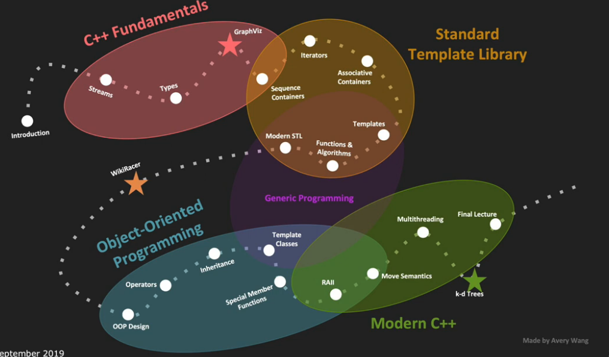
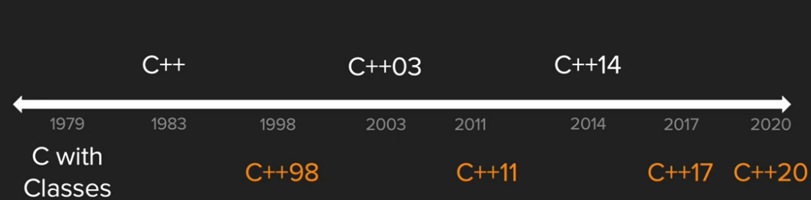

# Ch1. Introduction
> `Lecture notes for Stanford CS 106L` [playlist](https://www.youtube.com/playlist?list=PLCgD3ws8aVdolCexlz8f3U-RROA0s5jWA)
- Taught by `Avery Wang` and `Anna Zeng`
- Courses that use C++
    - BIOE 215: Physics-based simulation of bio structure
    - Medical robotics
    - Music, Computing, Design I
    - signal processing models ...
- Goals:
    - Learn what features C++ has and why they exist
    - Become comfortable with reading C++ documentation
    - Become familiar with the design philosophy of C++

- C++ History
    
    - Assembly is unportable
    - Assembly is too detailed for humans to write just simple programs
        
    - Assembly has low readability
    - C was popular then but it has no objects or classes (only `structs`)
    - C is tedious when writing large programs
