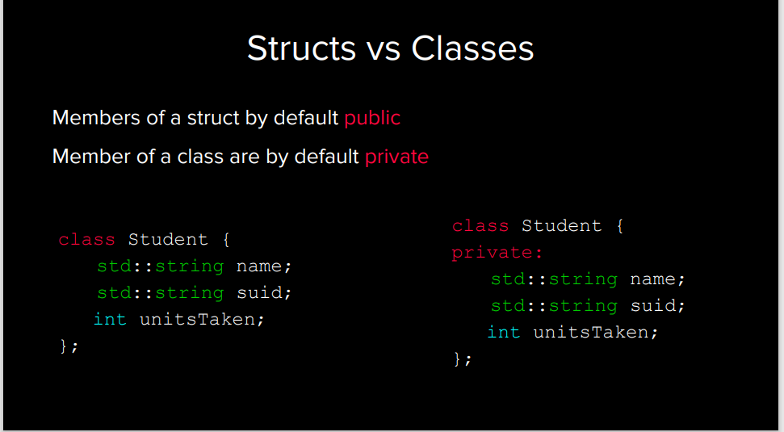
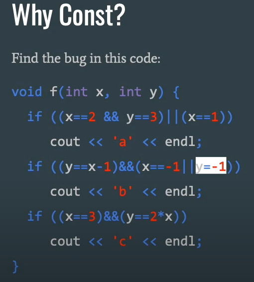

## Lec 10. Classes and Const Correctness

## Count the number of occurrences of a substring in a string
-  You cannot use `std::count` because it only counts the number of occurrences of a single character
-  You can use `std::search` to find the first occurrence of a substring

    ```cpp
    auto current = text.begin();
    auto end = text.end();
    int cnt = 0;
    while (curr!=end){
        current = search(current, end, pattern.begin(), pattern.end());
        // cuurent is now the first character of the pattern if exists
        if (current == end){
            break;
        }
        cnt++;
        current ++; // because in `nnn` to find `nn` the second `n` is the first character of the next search
    }
    ```

## OOP

- difference between `.hpp` and `.cpp` files
    - `.hpp` is the header file, which contains the declarations of the classes and functions (API)
    - `.cpp` is the implementation file, which contains the definitions of the classes and functions (the dirty work)

### Namespaces
- Scope resolution: There was a lot of `std::` and `algebra::` in your code
    - Why not just `using namespace std;`?
        - It's a bad practice because it pollutes the global namespace
### Const Correctness

- `const` allows you to make sure that the object is not modified (read-only) and it can be used in the following ways: **When in doubt, read from Right to Left**
    - `Const pointer` Means that you cannot change the address pointed by it
    - `const {datatype}` Means that you cannot change the value of the variable
    - Constant pointer to a non-constant int
        - `int * const p;`
        - You can change the value of the int (e.g. (*p)++), but not changing pointer itself like `p++`.
    - Non-constant pointer to a constant int
        - `const int* p;`
        - `int const* p;`
    - Constant pointer to a constant int
        - `const int* const p;`
        - `int const* const p;`
- `const` and classes
### Const Interators
- Remember that they act like pointers! So when talking about `const iterators`, ask which part is `const`?
    - The pointer itself or the value pointed by the pointer?
- I want the values to be constants:
    - Use `vector<int>::const_iterator`
    ```cpp
    vector<int>::const_iterator itr = v.begin();
    *itr = 5; // Error
    itr++; // OK
    ```
- I want the pointer to be constant:
    - Use `const vector<int>::iterator` (acts like `int* const`)
    - Meaning that it is a constant pointer to non-constant int; you CAN change the values pointed by the iterator!
    ```cpp
    const vector<int>::iterator itr = v.begin();
    *itr = 5; // OK
    itr++; // Error
    ```
### Chanllenge Mode
```cpp
const int* const MyClassMethod(const int* const& param) const;
// ----------------              ------------------------- ------
// A                              B                        C
```
- Return type (`A`): A constant pointer to a constant integer
- Argument (`B`): A constant reference to a constant pointer to a constant integer
- Function Mode (`C`): A constant method.
    - `const` methods: guarantees that the func won't call anything but `const` functions and won't modify any non-static and non-mutable member variables.
## Recap
- Anything that should not get modified should be marked as `const`.
- **Pass by `const` reference** instead of **pass by value**
    - Not true for primitive types (e.g. `int`, `double`, etc.)
- Member functions should have `const` iterators and non-const iterators.
- Read right to left to understand pointers.