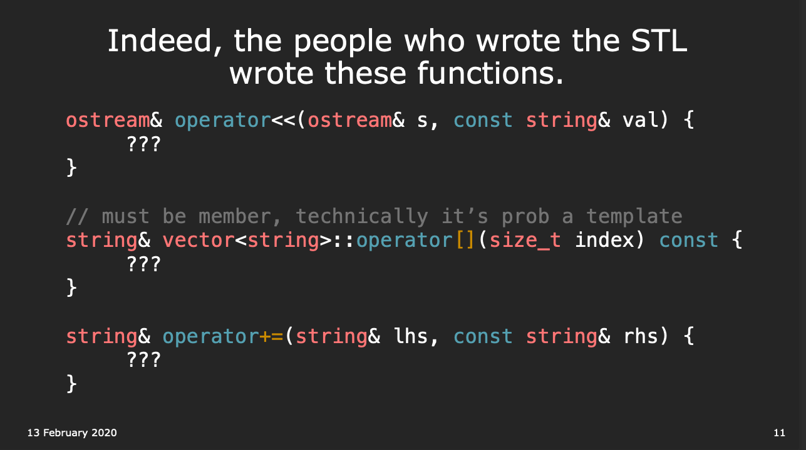

## Lec 11. Operators
Slides: https://web.stanford.edu/class/archive/cs/cs106l/cs106l.1204/lectures/operators/operators.pdf




## `+=` Operator Overloading
- `+=` returns a reference of the object itself, although ppl seldom use it.
- Argument 是 `const string&`:
    - Efficiency: `string` 是一個 class，如果不是 pass by reference `&`的話，會有 copy 的 overhead
    - Safety: `const` 保證這個 argument data 不會被改變
    - 記住，這樣不代表之後這個元素 `string` 不會在 vector 內被改變，只是這個 argument 在該函數不會被改變。

```cpp
// 效果：讓 vector<string> 可以 += string，把 string 加到 vector 的尾端
// e.g. v=["a", "b"], v+="c" 之後 v=["a", "b", "c"]
vector<string>& vector<string>operator+=(const string& elem){
    push_back(elem);
    return *this;
}

// 效果：讓 vector<string> 可以 += vector<string>，跟 Python 一樣是把兩個 vector 合併
// e.g. v1=["a", "b"], v2=["c", "d"], v1+=v2 之後 v1=["a", "b", "c", "d"]
vector<string>& vector<string>::operator+=(const vector<string>& other){
    for (string s: other) push_back(s);
    return *this;
}


vector<string> v = {"a", "b"};
v += "c";
v.back() = "d"; // this is allowed

```