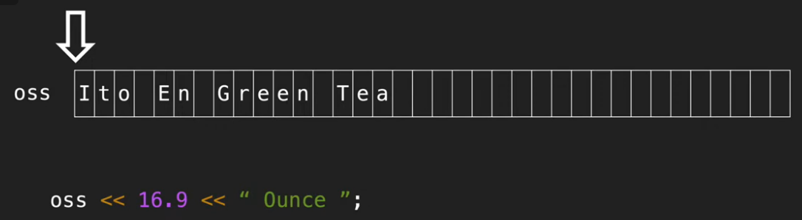
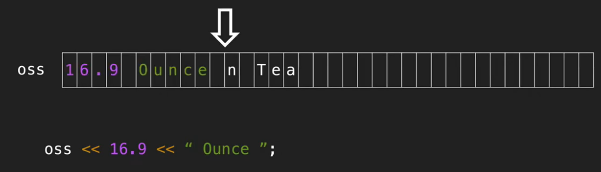
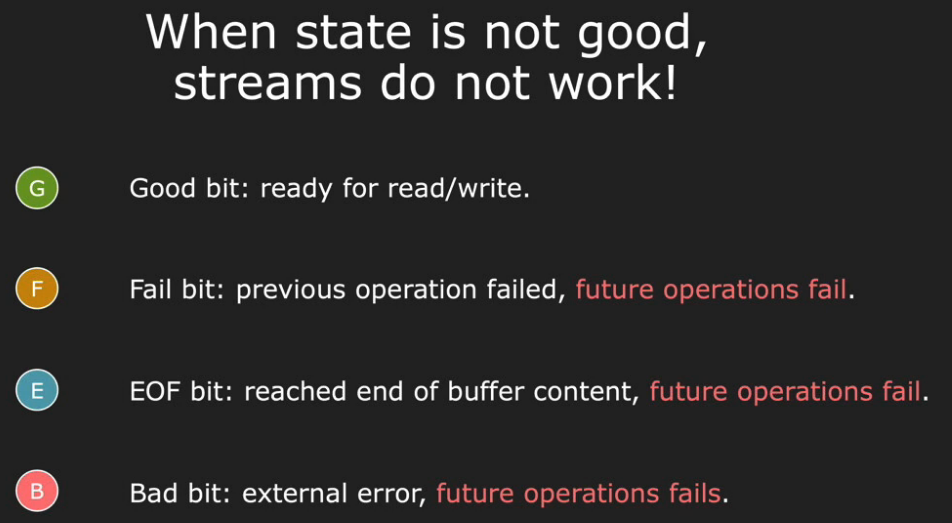
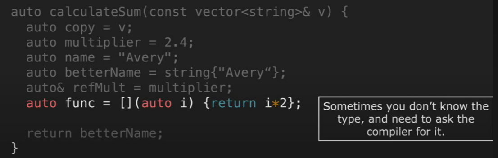

# Ch2. Streams
- Overview + stringstream
- State bits
- input/output streams (iostream)

## Background
- We want to interact with external devices (consoles&keyboards, files, pipelines, networking sockets,...)
## Demo




## C-string vs. C++ string
```cpp
#include <iostream>     // For C++ string examples
#include <string>       // For C++ string class
#include <cstdio>       // For C string examples
#include <cstdlib>      // For dynamic memory allocation in C
#include <cstring>      // For strcpy in C

int main() {
    // Example 1: Constructing a C String
    char c_string1[] = "Hello, C string!";
    std::printf("%s\n", c_string1);

    // Example 2: Constructing a C++ String
    std::string cpp_string1 = "Hello, C++ string!";
    std::cout << cpp_string1 << std::endl;

    // Example 3: Constructing a C String with Dynamic Memory Allocation
    char *c_string2 = (char *)std::malloc(30 * sizeof(char));
    if (c_string2 == NULL) {
        std::fprintf(stderr, "Memory allocation failed\n");
        return 1;
    }
    std::strcpy(c_string2, "Hello, dynamic C string!");
    std::printf("%s\n", c_string2);
    std::free(c_string2);

    // Example 4: Constructing a C++ String with String Concatenation
    std::string part1 = "Hello, ";
    std::string part2 = "C++ string!";
    std::string cpp_string2 = part1 + part2;
    std::cout << cpp_string2 << std::endl;

    return 0;
}

```
- C-string: `char*`:
    - by convention, end with a NUL byte. In terms of dynamic memory management, you can simply malloc the space for them (including the extra byte). Memory management when modifying strings is your responsibility:
- C++ string: `std::string` (a class that wraps a character array)
    - automatically manages memory for you
    - provides a lot of useful functions
    - can be used with `<<` and `>>` operators
    - can be used with `stringstream` [stringstream 用法速成](https://hackmd.io/@Maxlight/rJwlvj8ad)
    - You can (if you need one) always construct a C string out of a std::string by using the `.c_str()` method.
## getline
```cpp
int favvNum;
cin >> favNum;
cin >> ws; // eat up the white space
string name;
getline(cin, name);
```

```cpp
string s="Hello,world!";
stringstream ss(s);
while (getline(ss, s, ',')){ // separate the string by ',' just like .split() in Python
    cout << s << endl;
    // Hello
    // world!
}
```


## `iostream` (input/output streams)

- Fail bit:
    - 类型不能正确匹配（type mismatch）
    - 文件无法打开
    - seekg方法失败
### Buffering
- `cout`: need to flush the buffer to see the output
### `auto`
- automatically infer the type of a variable
- You can use it in almost all places **except for function arguments, return types, and class members**.
- Guidelines
    - Use it when type is obvious in the context or when the EXACT type is unimportant (e.g. iterators of a map)
    - Don't use it when it obviously hurts readability


## Functions and Parameter Passing

- Use tne advanced parameter passing only after demonstrating and documenting the need.
- Reference: https://cpp-core-guidelines-docs.vercel.app/functions#fcall-parameter-passing