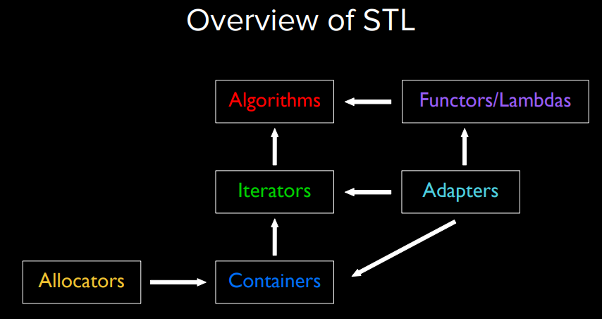

# Ch3. Sequence Containers

## structs
- a very light-weight class
```cpp
struct Point {
    double x; // reference
    double y;
};

Point p={3.0, 4.0};
// when you want to get .x field
std::cout << p.x << std::endl;
std::cout << p.y << std::endl;
// kind of separating to x and y
auto [x, y] = p; // note that you can do this to a pair as well!
```
## STL
As mathematicians learned to lift theorems into their most general setting, I wanted to lift
lift algorithms and data structures into their most general setting. - Alex Stepanov

- Why doesn't `std::vector` check the bounds by default?
    - If you write it correctly, checking the bounds is redundant and slows down the program.
- What happens if you want to push an element into the front vector?
    - You'll have to shift all the elements to the right, because the vector is a contiguous block of memory an dits first element is at the beginning of the block.
    - `push_front()` is not a member function of `std::vector`
    - You can use a `std::deque` instead (both `push_front()` and `push_back()` are O(1): In a doubly-linked list implementation (doubly-linked chunks of memory in fact) and assuming no allocation/deallocation overhead, the time complexity of all deque operations is O(1); however when it comes to allocating a new chunk it is costly, which is why it is amortized O(1)).
## Initialization
- C++ has 27 ways to initialize things...
- C++ ironically adds one more way called `uniform initialization`
```cpp
struct Time{
    int hour;
    int minute;
};
struct Course{
    string name;
    Time startTime; // another nested uniform initialization
    Time endTime;
    vector<string> instructors;
}
Course c1 = {"CS106L", {13, 30}, {15, 20}, {"Avery", "Anna"}};
```
```cpp

#include<vector>
#include<iostream>

using namespace std;
int main(){
    vector<int> v{1,2,3,4,5};
    // cout the address
    cout << &v << endl;
    v = {1,2,5,4,5,6}; // you can change the size of the vector/the content and the address will remain the same
    cout << &v << endl;
    for (int i = 0; i < v.size(); i++){
        cout << v[i] << " ";
    }

}
```

## Sorting
In insertion sort elements are bubbled into the sorted section, while in bubble sort the maximums are bubbled out of the unsorted section.

- Bubble sort O(n^2) avg
after i-th iteration, the elements from i to n-1 are sorted (0-indexed) and they are the maximums of the array.
```cpp
for (int i = 0; i< A.size(); i++){
    for (int j = 0; j< A.szie()-i-1;j++){
        if (A[j] > A[j+1]){
            swap(A[j], A[j+1]); // bubbling the maximum to the end
        }
    }
}

```
- Insertion sort O(n^2) avg
```cpp
for (int i = 0; i< A.size(); i++){
    int j = i;
    while (j> 0 && A[j] < A[j-1]){
        swap(A[j], A[j-1]); // moving the i-th elemnt to the correct position
        j--;
    }
}